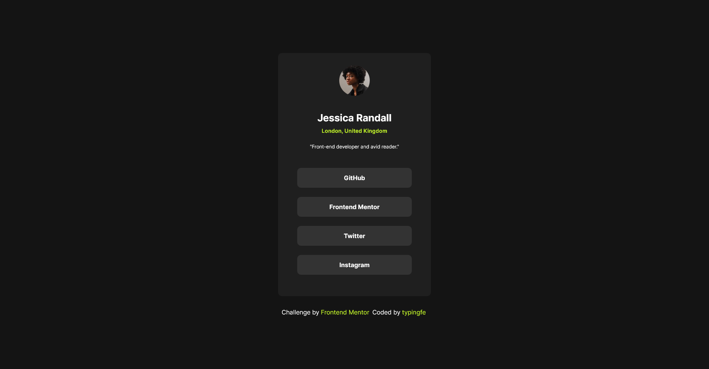

# Frontend Mentor - Social links profile solution

This is a solution to the [Social links profile challenge on Frontend Mentor](https://www.frontendmentor.io/challenges/social-links-profile-UG32l9m6dQ). Frontend Mentor challenges help you improve your coding skills by building realistic projects.

## Table of contents

- [Screenshot](#screenshot)
- [Links](#links)
- [Build-With](#built-with)
- [Author](#author)

### Screenshot

### Links

- Live Site URL: [Link to my project](https://social-links-profile-main-olive-zeta.vercel.app/)

### Built with

- Semantic HTML5 markup
- Flexbox
- Mobile-first workflow

## Author

- Linkedin - [typingfe](https://www.linkedin.com/in/typingfe/)
- Frontend Mentor - [@typingfe](https://www.frontendmentor.io/profile/typingfe)
- Twitter - [@typingfe](https://x.com/typingfe)
